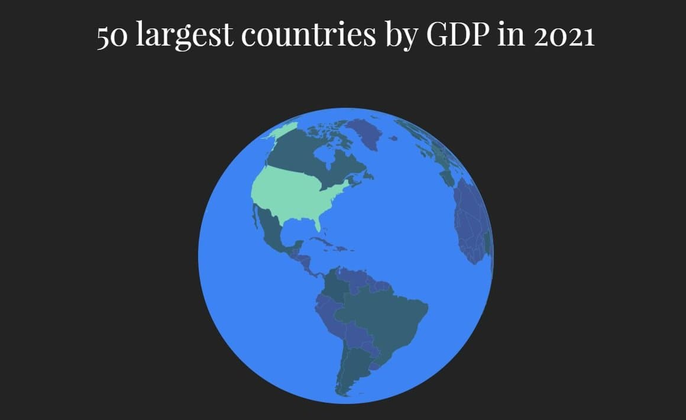

# 50-economies
Top 50 economies in the world in 2021
Just four countries—the U.S., China, Japan, and Germany—make up over half of the world’s economic output by gross domestic product (GDP) in nominal terms. In fact, the GDP of the U.S. alone is greater than the combined GDP of 170 countries.
[Population of Russia](https://recreatorus.github.io/50-economies/index.html 'watch demo')

